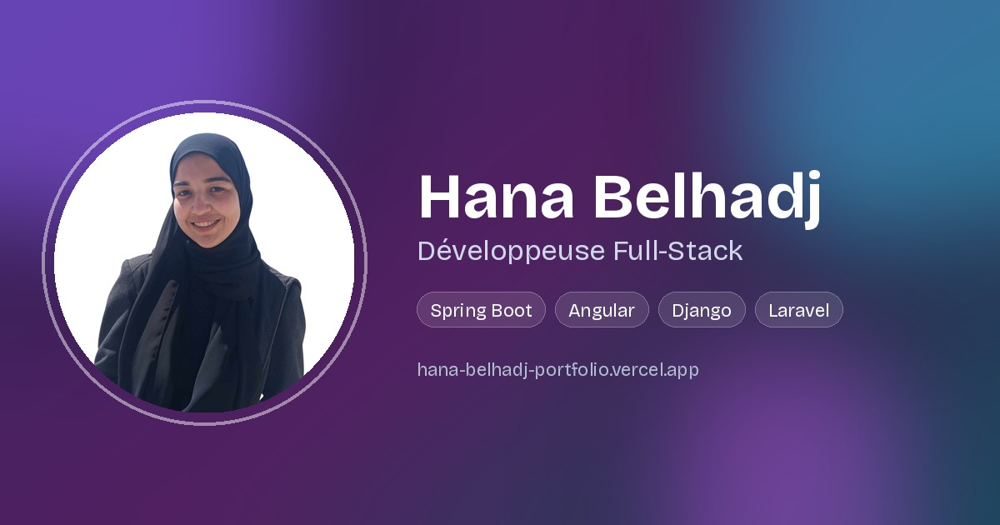

<div align="center">

# Hana Belhadj — Portfolio

### Développeuse Full-Stack basée en Tunisie

[](https://hana-belhadj-portfolio.vercel.app/)
[](https://www.linkedin.com/in/hana-belhadj)
[](https://github.com/hana270)

</div>

---

## À propos

Ce dépôt contient le code source de mon portfolio personnel : une vitrine de mes projets, mon parcours professionnel, mes certifications et les services que je propose en freelance (développement web, applications responsives, CV ATS-Friendly, cartes d'invitation virtuelles).

**🔗 Voir le site en ligne : [hana-belhadj-portfolio.vercel.app](https://hana-belhadj-portfolio.vercel.app/)**

## Aperçu

<!-- Remplace cette ligne par une vraie capture d'écran une fois prête -->
<!--  -->

## Fonctionnalités

- 🎨 Design moderne avec dégradés animés et effets de survol
- 📱 Entièrement responsive (mobile, tablette, desktop)
- ⚡ Animations d'entrée et compteurs de statistiques animés au scroll
- 🗂️ Filtrage des projets par catégorie (Web / Mobile / Desktop)
- 🏆 Section certifications avec liens de vérification
- 💼 Section services freelance (développement web, CV ATS-Friendly, cartes d'invitation virtuelles)
- 📩 Formulaire de contact
- 🔍 Optimisé pour le référencement (SEO, Open Graph, données structurées Schema.org)

## Stack technique

| Catégorie | Technologies |
|---|---|
| Frontend | React, TypeScript, Tailwind CSS |
| Build | Vite |
| Icônes | Lucide React |
| Déploiement | Vercel |

## Installation locale

```bash
# Cloner le dépôt
git clone https://github.com/hana270/hana-belhadj-portfolio.git
cd hana-belhadj-portfolio

# Installer les dépendances
pnpm install

# Lancer le serveur de développement
pnpm dev
```
Le site sera accessible sur `http://localhost:5173`.

## Déploiement

Le site est déployé automatiquement sur **Vercel** à chaque `git push` sur la branche `main`.

## Projets présentés

Le portfolio référence mes principaux projets académiques et professionnels, notamment :
- Une plateforme e-commerce en architecture microservices (Spring Boot, Angular, Keycloak)
- Une application de gestion CRUD avec Django, déployée en ligne
- Un jeu de mémoire responsive en React ([démo en ligne](https://color-memory-challenge.vercel.app))
- Plusieurs projets académiques (Java, PHP/Laravel, CodeIgniter, Android)

Tous les dépôts individuels sont disponibles sur [github.com/hana270](https://github.com/hana270).

## Contact

- 📧 hanabelhadj27@gmail.com
- 💼 [LinkedIn](https://www.linkedin.com/in/hana-belhadj)
- 📍 Hammamet, Tunisie

Disponible pour des stages, alternances et missions freelance.

---

<div align="center">
<sub>© 2026 Hana Belhadj</sub>
</div>
